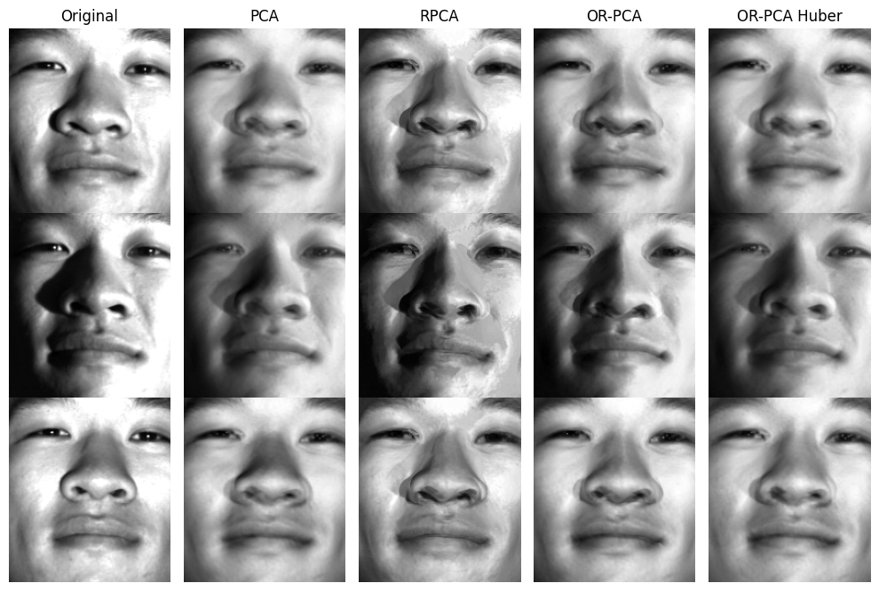
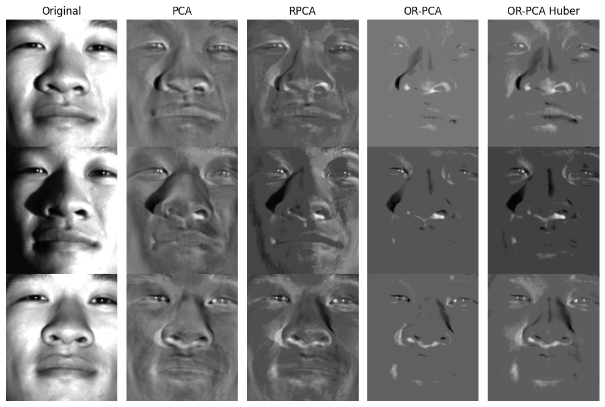

# Online Robust Principle Component Analysis With Huber Loss for Low-Rank Image Recovery

This was the final project for the undergraduate course MATH4336: Introduction to Mathematics of Image Processing. In this [report](report.pdf), we briefly explore an extension to [online robust principle component analysis](https://papers.nips.cc/paper/2013/hash/8f121ce07d74717e0b1f21d122e04521-Abstract.html).

If you have any questions, you can find my email on my personal website and I'll be more than happy to help.
